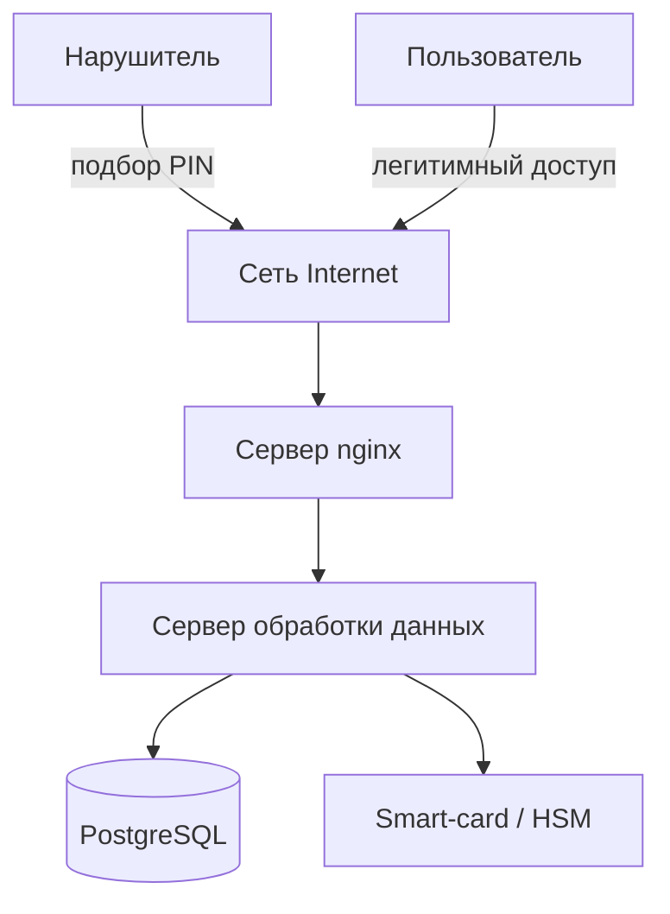
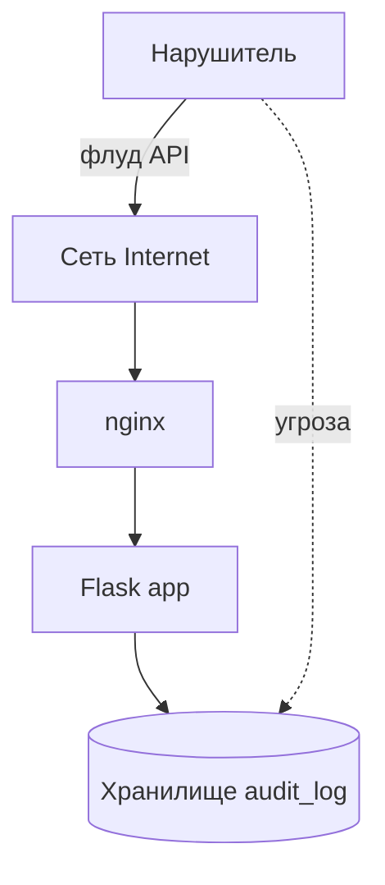
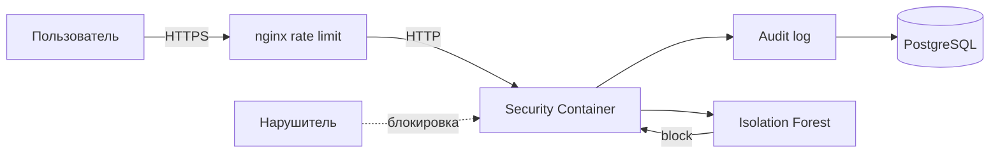
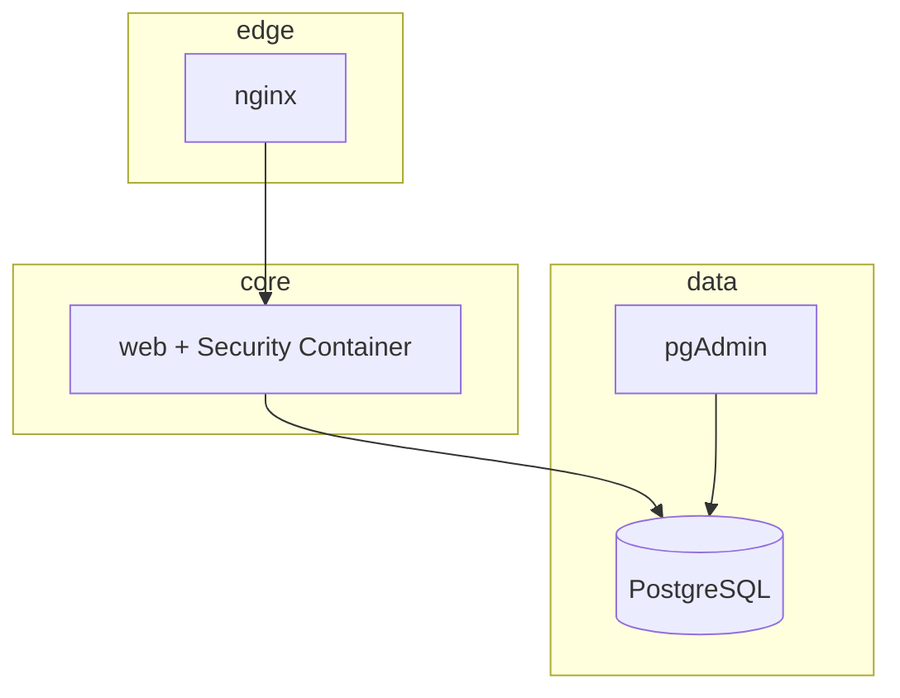

# ПРЕЗЕНТАЦИЯ — ТЕКСТ СЛАЙДОВ

Скопируйте каждый блок на отдельный слайд PowerPoint. Диаграммы — из раздела «Схемы» в конце файла (Mermaid → export PNG).

---

## Слайд 1 — Титульный

**Финансовый университет**  
Факультет: Информационные технологии и анализ данных (уточнить у кафедры)

**Зачётная работа**

**Тема:** Разработка контейнера для обеспечения безопасности приложения на Smart-карте при угрозе получения несанкционированного доступа (вариант 216)

**Студент:** Курбанов Умар Рашидович  
**Группа:** ИД23-1

**Руководитель:** _________________________

Москва, 2025

---

## Слайд 2 — ТЗ: цель и основание

- **Цель:** защита SaaS-приложения, работающего со Smart-картой
- **УБИ:** несанкционированный доступ (подбор PIN, флуд запросов)
- **Основание:** задание вариант 216
- **Результат:** Docker + Kubernetes + ML-аналитика

---

## Слайд 3 — ТЗ: функции системы

1. Security Container — блокировка сессий  
2. Аудит в PostgreSQL  
3. ML: Isolation Forest  
4. Веб-дашборд (таблица + графики)  
5. 4 контейнера: nginx, web, db, pgadmin

---

## Слайд 4 — ТЗ: алгоритм обработки (вариант 3)

| Этап | Действие |
|------|----------|
| Ввод | CSV логов доступа |
| Признаки | PIN fail, RPM, hour |
| ML | Isolation Forest |
| Выход | Таблица + 3 графика |
| Действие | block_recommended → блокировка карты |

---

## Слайд 5 — ТЗ: инфраструктура

- **SaaS:** Flask + Gunicorn  
- **Docker Compose:** 4 сервиса, сеть bridge  
- **Kubernetes:** 1 Pod × 4 контейнера  
- **Данные:** 500 записей testdata.csv

---

## Слайд 6 — ТЗ: критерии приёмки

- ✓ Все контейнеры running  
- ✓ nginx :8080 доступен  
- ✓ ML-анализ CSV  
- ✓ Pod Kubernetes Ready  
- ✓ Отчёт и презентация

---

## Слайд 7 — Модель угроз (сценарий 1)

**Сценарий:** подбор PIN на терминале

См. схему Threat Model 1 (ниже). Элементы: Нарушитель, Пользователь, Сеть Internet, nginx, Web, PostgreSQL, Smart-card (хранилище ключей).

---

## Слайд 8 — Модель угроз (сценарий 2)

**Сценарий:** DDoS / флуд API к SaaS

Нарушитель → Internet → nginx → обработчик → перегрузка / обход аутентификации → компрометация журналов в БД.

---

## Слайд 9 — Механизм защиты (схема)

**Security Container + ML**

- TLS (на проде), rate limit nginx  
- Пороги PIN/RPM → блокировка 15 мин  
- Audit log → PostgreSQL  
- Isolation Forest → block_recommended  
- Репликация: backup БД (архитектурно)

---

## Слайд 10 — Механизм защиты (протоколы)

| Связь | Механизм |
|-------|----------|
| User → nginx | HTTP, limit_req |
| nginx → web | reverse proxy |
| web → db | PostgreSQL protocol |
| web → security | функции block(), audit() |
| ML → policy | JSON API /analyze |

---

## Слайд 11 — Архитектура микросервисов

1. **nginx** — edge  
2. **web + security** — ⭐ сервис защиты  
3. **postgresql** — хранилище  
4. **pgadmin** — администрирование  
5. *(опционально)* **ml-worker** — встроен в web

Не более 5. **Выделен:** web + модуль `security/`.

---

## Слайд 12 — Паттерн SaaS

Клиент → API Gateway (nginx) → Application Service (Flask) → Database. Cross-cutting: Security Container, Audit, Anomaly Detection.

---

## Слайд 13 — config.yaml (фрагмент)

Показать на слайде:

```yaml
spec:
  containers:
    - name: db
    - name: web
    - name: nginx
    - name: pgadmin
```

Namespace, ConfigMap, Secret, Service NodePort.

---

## Слайд 14 — Развёртывание Kubernetes

1. `docker build -t smartcard-web:1.0`  
2. `kubectl apply -f k8s/config.yaml`  
3. `kubectl get pods -n smartcard-security`  
4. `port-forward 8080:80`

Скриншот терминала — вставить из работы.

---

## Слайд 15 — Генерация данных

`python data/generate_data.py` → 500 строк, 80% normal / 20% attack.

Поля: session_id, card_id, timestamp, failed_pin_count, requests_per_min, label.

---

## Слайд 16 — Проверка и ML-результаты

- Health OK  
- Блокировка при PIN≥3  
- ML: anomalies_detected, accuracy  
- Скриншоты: таблица + 3 графика из UI

---

## Слайд 17 — Выводы

- Реализован контейнер безопасности для Smart-card SaaS  
- 4 контейнера Docker + 1 Pod Kubernetes  
- ML успешно выделяет атаки на тестовом наборе  
- Готово к демонстрации на зачёте

---

# СХЕМЫ ДЛЯ СЛАЙДОВ 7–11 (Mermaid)

## Threat Model 1



## Threat Model 2



## Protection Mechanism



## Microservices



---

*Курбанов У.Р., ИД23-1, Финансовый университет*
